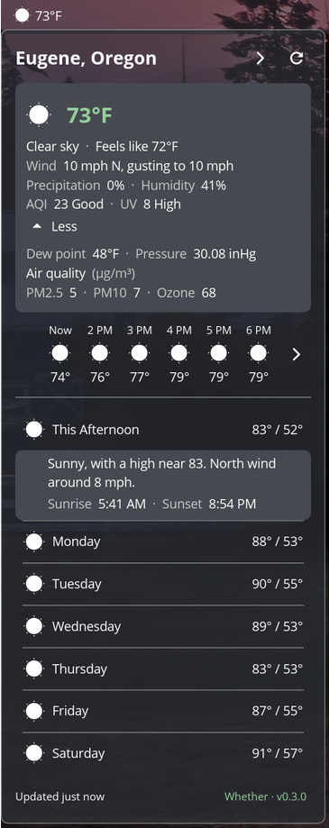
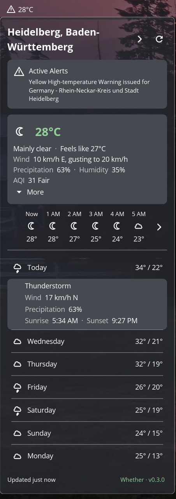

# Whether

A weather applet for the [COSMIC](https://github.com/pop-os/cosmic-epoch) desktop panel.

<table>
  <tr>
    <td valign="top"></td>
    <td valign="top"></td>
  </tr>
</table>

## Features

- **Current conditions** - temperature, feels-like, humidity, wind & gusts, precipitation, AQI, and UV index
  - Click **More** for dew point, pressure, and the pollutant breakdown (PM2.5, PM10, ozone)
- **Worldwide weather alerts**, shown inline when active
- **Hourly and 7-day forecasts** - click any day to expand its detailed forecast, wind, precipitation, and
  sunrise/sunset
- **Automatic data sourcing by location** via [weathervane](https://github.com/crenshawdev/weathervane):
  - **NWS** (National Weather Service) - US locations, free, no API key
  - **Open-Meteo** - worldwide, free ([CC BY 4.0](https://open-meteo.com/en/license))
  - **JMA** - Japan, free
- **Location search** via [Nominatim](https://nominatim.openstreetmap.org/) (OpenStreetMap), with multiple saved locations
- **Imperial/Metric toggle** - click the hero temperature to switch between imperial (°F, mph, inHg) and metric (°C, km/h, hPa)
- **Panel display** - day/night-aware weather icon and current temperature

## Translations

Whether is available in English and, thanks to its translators, in:
- **Swedish** - [@bittin](https://github.com/bittin)
- **Polish** - [@skajmer](https://github.com/skajmer), [@VandaLHJ](https://github.com/VandaLHJ)
- **Portuguese (Brazil)** - [@wag-panfilli](https://github.com/wag-panfilli)

To add a language, copy `i18n/en/cosmic_ext_whether.ftl` into a new locale directory under `i18n/` and open a pull request.

Some of what you see comes from the weather service rather than from Whether, and appears in whatever
language that agency publishes:

- **Weather alert headlines** are written by the issuing agency (NWS, MeteoAlarm, ECCC, BOM) and keep its wording.
- **US daily forecast detail** ("Sunny, with a high near 82. North northwest wind 2 to 9 mph.") is authored by the
  National Weather Service and is English only.
- **Condition descriptions** fall back to the provider's own wording when a report doesn't map to a known condition.

Everything Whether renders itself - conditions, wind directions, weekdays, times, and all interface text - is translated.

## Installation

Download the latest release from the [Releases](https://github.com/nwxnw/cosmic-ext-whether/releases) page.

### Debian/Ubuntu (.deb)

```sh
sudo apt install ./cosmic-ext-whether_0.3.1_amd64.deb
```

### Flatpak

```sh
flatpak install --user ./cosmic-ext-whether_0.3.1.flatpak
```

### From source

Requires Rust, [just](https://github.com/casey/just), and system dependencies:

```sh
sudo apt install libxkbcommon-dev wayland-protocols libwayland-dev
```

```sh
just build-release
just install
```

Then add **Whether** to your COSMIC panel via Settings > Desktop > Panel > Applets.

### Uninstall

```sh
just uninstall
```

If you previously installed via `sudo just install`, run `sudo just uninstall-system` once to clear the old `/usr` install.

## License

[GPL-3.0-only](LICENSE)
